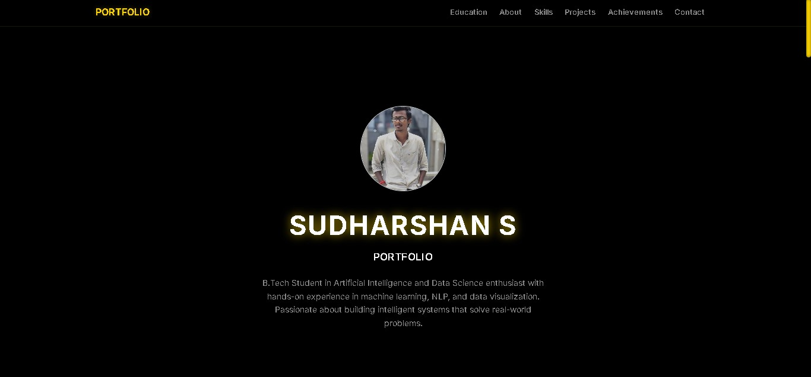

# 🌟 Django Admin-Managed Portfolio

🚀 Live Demo: [sudharshan-portfolio.onrender.com](https://sudharshan-portfolio.onrender.com) 

     


---

## ✨ Why This Portfolio Stands Out

- 🔧 **Fully Admin-Managed** — Add/edit all content via `/admin` with zero code updates
- 🧠 **Smart Content Showcase** — Skills, Projects, Education, Achievements, and Contact in one place
- 🎨 **Neo Theme** — Deep Navy (#0A192F) + Electric Yellow (#FFD700) with smooth animations
- 📱 **Responsive Design** — Flawless on mobile, tablet, and desktop
- 📊 **Skills Visualization** — Animated progress bars for 15+ technical & soft skills
- 🖼️ **Project Gallery** — Cards with GitHub links + Hugging Face demos
- 🧭 **Dynamic Navbar** — Auto-highlights active section as you scroll

---

## 🛠️ Tech Stack

| Layer      | Tech Used                          |
|------------|------------------------------------|
| Backend    | Django 5.2                         |
| Frontend   | Bootstrap 5 + Vanilla JS           |
| Styling    | Custom CSS with CSS Variables      |
| Icons      | Font Awesome 6.4                   |
| Deployment | Render (Free Tier)                 |

---

## 📥 Quick Setup

```bash
git clone https://github.com/sudharshan59/django-portfolio.git
cd django-portfolio
python -m venv venv && source venv/bin/activate  # Linux/macOS
pip install -r requirements.txt
python manage.py migrate && python manage.py createsuperuser
python manage.py runserver
✅ Visit http://127.0.0.1:8000 — then customize everything in /admin

☁️ Deploy in 5 Minutes (Render)
Push to GitHub

Create Web Service on Render

Set build command:

bash
pip install -r requirements.txt && python manage.py collectstatic --noinput
Set start command:

bash
gunicorn portfolio_site.wsgi:application
Run migrate in Console → upload content via /admin

🎯 Perfect For
Students showcasing academic projects

Developers highlighting GitHub repos

Data Scientists demonstrating AI/ML work

Job Seekers wanting a sleek, modern resume site

“Your work deserves to shine — not hide in a PDF.”

📸 Portfolio Highlights
🖼️ Hero Section: Centered profile photo with glow border

🎓 Education Timeline: 

🤖 AI/ML Projects: 4 real projects with live demos + GitHub

🏆 Certifications: Your details

📬 Contact Hub: Email, phone, GitHub, LinkedIn, LeetCode — all clickable

⭐ Star This Repo
If this portfolio helped you stand out, give it a ⭐ and share it with others! 🔗 GitHub Repo

🧑‍💻 Made with ❤️ by Sudharshan
